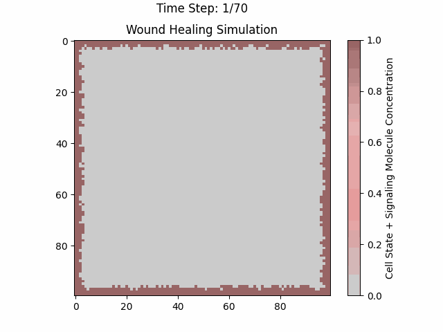

# Wound Healing Simulation 🩹💻

Welcome to the Wound Healing Simulation project! This Python simulation models the process of wound healing, incorporating biological principles such as chemotaxis, cell proliferation, differentiation, and apoptosis.



## Installation

Follow these steps to set up the simulation on your local machine:

### Prerequisites

- Python (>= 3.6)

### Clone the Repository

```bash
git clone https://github.com/Rishit-katiyar/wound-healing-simulation.git
```

### Navigate to the Project Directory

```bash
cd wound-healing-simulation
```

### Install Dependencies

```bash
pip install -r requirements.txt
```

## Usage

To run the simulation, execute the following command:

```bash
python wound_healing_simulation.py
```

This will launch the simulation window where you can observe the wound healing process over time. You can adjust the simulation parameters and constants in the Python script to customize the behavior of the simulation.

## Features

- **Biologically Accurate**: Incorporates chemotaxis, cell cycle dynamics, differentiation, apoptosis, and other biological mechanisms involved in wound healing.
- **Customizable Parameters**: Easily modify simulation parameters and constants to explore different scenarios.
- **Realistic Visualization**: Uses a custom color scheme resembling human tissue colors for a visually appealing representation of the wound healing process.
- **Interactive Simulation**: Provides a dynamic and interactive simulation window to observe the progression of wound healing over time.

## Contributing

Contributions are welcome! If you have any suggestions, feature requests, or bug reports, please open an issue or submit a pull request.

## License

This project is licensed under the GNU General Public License v3.0. See the [LICENSE](LICENSE) file for details.

## Acknowledgements

- Inspired by the fascinating processes of wound healing in biological systems.
- Built with Python, NumPy, and Matplotlib.
